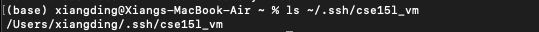

Here is my code:
```
import com.sun.net.httpserver.HttpServer;
import com.sun.net.httpserver.HttpExchange;
import com.sun.net.httpserver.HttpHandler;

import java.io.IOException;
import java.io.OutputStream;
import java.net.InetSocketAddress;
import java.util.HashMap;
import java.util.Map;

public class ChatServer {
    private static String chatHistory = "";

    public static void main(String[] args) throws IOException {
        int port = 2000;
        HttpServer server = HttpServer.create(new InetSocketAddress(port), 0);
        server.createContext("/add-message", new MessageHandler());
        server.setExecutor(null); 
        server.start();
        System.out.println("Server started on port " + port);
    }

    static class MessageHandler implements HttpHandler {
        @Override
        public void handle(HttpExchange exchange) throws IOException {
            Map<String, String> params = queryToMap(exchange.getRequestURI().getQuery());
            String user = params.get("user");
            String message = params.get("s");
            synchronized (chatHistory) {
                chatHistory += user + ": " + message + "\n";
            }

            exchange.sendResponseHeaders(200, chatHistory.getBytes().length);
            OutputStream os = exchange.getResponseBody();
            os.write(chatHistory.getBytes());
            os.close();
        }

        private Map<String, String> queryToMap(String query) {
            Map<String, String> result = new HashMap<>();
            for (String param : query.split("&")) {
                String[] entry = param.split("=");
                if (entry.length > 1) {
                    result.put(entry[0], entry[1]);
                } else {
                    result.put(entry[0], "");
                }
            }
            return result;
        }
    }
}


```


1. The ```handle```method in MessageHandler is called.
2. The relevant arguments: ```HttpExchange exchange```
3. The elevant fields of the class changes: chatHistory changes from "" to "jpolitz: Hello\n".


!
1. The ```handle``` method in MessageHandler is called again.
2. The relevant arguments:  ```HttpExchange exchange```
3. The elevant fields of the class changes: chatHistory changes from "jpolitz: Hello\n" to "jpolitz: Hello\nyash: How are you\n"

Part2:
1. The abs path for the keys in local


2. The abs path for the keys in remote


3. SSH into the vm without password


Part3:

In weeks 2 and 3 of the lab, I learned about using `ssh` (Secure Shell) to securely access a remote server or virtual machine, a concept I was previously unfamiliar with. This knowledge opened up the possibility of remotely managing systems and executing commands on them as if I were physically present. Additionally, I discovered the utility of `scp` (Secure Copy Protocol), which allows for the secure transfer of files between a local machine and a remote server. I also learned that using SSH keys for authentication can eliminate the need for entering passwords repeatedly, enhancing both convenience and security.


